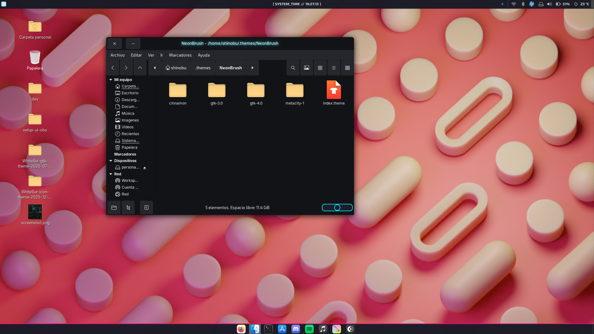
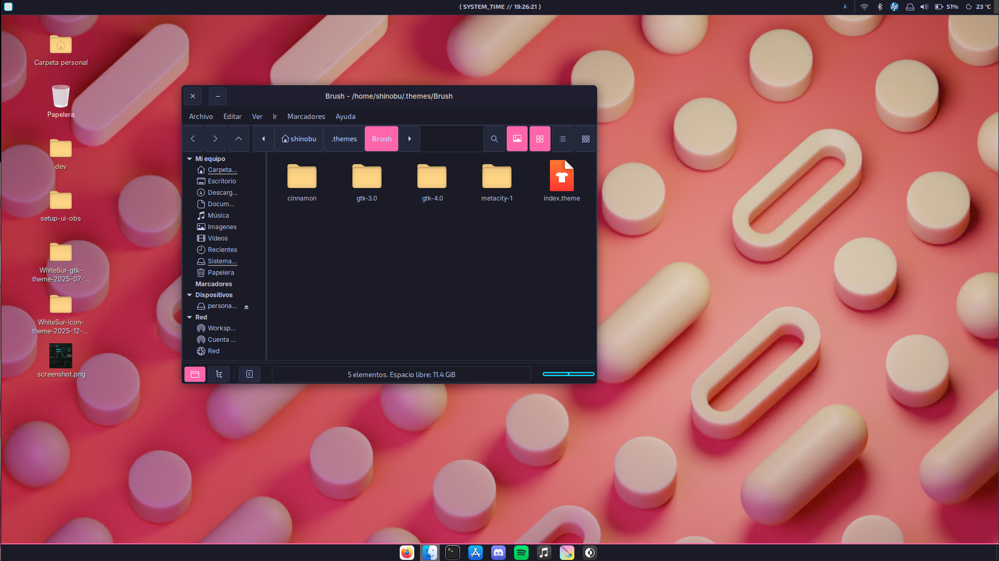

<p align="center">
  
</p>

# BrushUI – NeonBrush Theme

**BrushUI** es un proyecto que contiene tu tema visual inspirado en pintura digital y efectos neón para entornos **Cinnamon (Linux Mint / Ubuntu Cinnamon)** y interfaces GTK.  
Incluye dos variantes principales: **Brush** y **NeonBrush**, cada una con su estilo y personalidad.

---

## 🎨 ¿Qué es Brush / NeonBrush?

Este proyecto reúne un conjunto de estilos y paletas de color pensadas para interfaces modernas, creativas y visualmente atractivas:

- **Brush**: tema base con colores mate y trazos suaves.  
- **NeonBrush**: subtema con efectos de glow neón, saturación alta y acentos vibrantes.

El objetivo es dar un aspecto artístico, inspirado en pinceles digitales, UI de arte y contrastes modernos.

---

## 🖼️ Estructura del repositorio

BrushUI/
├── Brush/ # Archivos del tema Brush
├── NeonBrush/ # Archivos del tema NeonBrush
├── NeonBrush Logo.svg # Logo principal del tema
├── LICENSE # Licencia MIT
└── README.md # Este archivo


---

## 🌟 Características

- 🎨 **Paleta visualmente atractiva** con rosa y cyan vibrante.  
- 🖌️ **Diseño inspirado en pinceles** y trazos digitales.  
- 🌙 **Modo oscuro por defecto** para confort visual.  
- 💡 Compatible con entornos GTK y Cinnamon.  
- 📁 Incluye variantes “Brush” y “NeonBrush”.

---

## 📸 Capturas

<p align="center">
  
</p>
<p align="center">
  
</p>

*(Añade aquí más capturas dentro de la carpeta `screenshots/` si las tienes)*

---

## 📥 Instalación

### Para Cinnamon

1. Clona el repositorio:
   ```bash
   git clone https://github.com/Shinobu-haruto/BrushUI.git


cp -r BrushUI/Brush ~/.themes/
cp -r BrushUI/NeonBrush ~/.themes/
